<!-- Optional banner: add a wide hero image to screenshots/ and uncomment -->
<!--  -->
 
# Engagement Hub — Client Project Intake & Delivery Prep Agent
 
> ### 🥈 2nd Place — Microsoft Agent Academy Live Hackathon · Operative Track
 
A multi-agent Microsoft **Copilot Studio** and **Power Platform** system that turns an unstructured client submission into a governed Engagement Request, AI-analysed risk assessment, delivery discovery brief and Word handoff document — with human review, Teams notifications and full audit logging built in.
 
[](https://learn.microsoft.com/en-us/microsoft-copilot-studio/)
[](https://powerautomate.microsoft.com/)
[](https://learn.microsoft.com/en-us/power-apps/maker/data-platform/)
[](https://adaptivecards.io/)
[](https://leilamarchant.co.uk/case-study-engagement-hub/)
 
---
 
> **👋 Reviewing this repo?** The fastest way to understand the project is the **[demo video, about 4 minutes](https://youtu.be/Tzn6pMMoEAw)**, then the **[full case study](https://leilamarchant.co.uk/case-study-engagement-hub/)** for architecture detail and screenshots.
 
---
 
## Contents
 
- [Quick links](#quick-links)
- [The problem](#the-problem)
- [What it does](#what-it-does)
- [Architecture](#architecture)
- [Key patterns and design decisions](#key-patterns-and-design-decisions)
- [Screenshots](#screenshots)
- [Technology stack](#technology-stack)
- [Repository structure](#repository-structure)
- [Lessons learned](#lessons-learned)
- [Governance and safety boundaries](#governance-and-safety-boundaries)
- [Documentation](#documentation)
- [Author](#author)
---
 
## Quick links
 
| Resource | Link |
|---|---|
| 🎬 Demo video | [YouTube walkthrough (about 4 minutes)](https://youtu.be/Tzn6pMMoEAw) |
| 🌐 Full case study | [leilamarchant.co.uk/case-study-engagement-hub](https://leilamarchant.co.uk/case-study-engagement-hub/) |
| 📄 Case study PDF | [docs/Engagement_Hub_Case_Study.pdf](docs/Engagement_Hub_Case_Study.pdf) |
| 📋 ALM release checklist | [docs/Engagement_Hub_ALM_Release_Checklist.pdf](docs/Engagement_Hub_ALM_Release_Checklist.pdf) |
| 👤 Portfolio | [leilamarchant.co.uk](https://leilamarchant.co.uk/) |
| 💼 LinkedIn | [in/leilamarchant](https://www.linkedin.com/in/leilamarchant) |
 
---
 
## The problem
 
Consultancy teams receive client briefs, contracts and statements of work in fragmented, unstructured ways. The result is slow triage, missed risks, inconsistent routing, duplicate records and incomplete delivery handoffs.
 
Engagement Hub replaces that process with a governed, multi-agent intake and delivery-prep workflow — designed for the Microsoft partner and consultancy context.
 
---
 
## What it does
 
| Step | What happens |
|---|---|
| 1 | A client submission with an attached document is captured in Dataverse, and the user asks the agent to analyse it |
| 2 | The contract-analysis flow retrieves the document, extracts text, runs an AI prompt, and returns risk flags, missing information, a confidence score and a human-review recommendation |
| 3 | A structured Analysis Result is saved to Dataverse and the Submission is updated with high-level review information |
| 4 | The user selects a service route; the controlled workflow resolves it to the appropriate Service Offering record |
| 5 | The agent shows a confirmation card and waits for explicit approval before creating an Engagement Request |
| 6 | The create flow checks for an existing active Engagement Request in the same business context; it returns the existing record or creates a new one |
| 7 | The user initiates delivery handoff; the Delivery Prep Child Agent generates and saves a structured Discovery Brief |
| 8 | The user can optionally generate a Word handoff document, which is populated from Dataverse-grounded content, saved to SharePoint and linked back to the Engagement Request|
| 9 | When human review is required, an event-driven flow checks for a prior successful notification before posting a Teams adaptive card |
| 10 | Key automated actions are written to Automation Logs with correlation IDs, event names, success flags and related-record references |
 
---
 
## Architecture
 
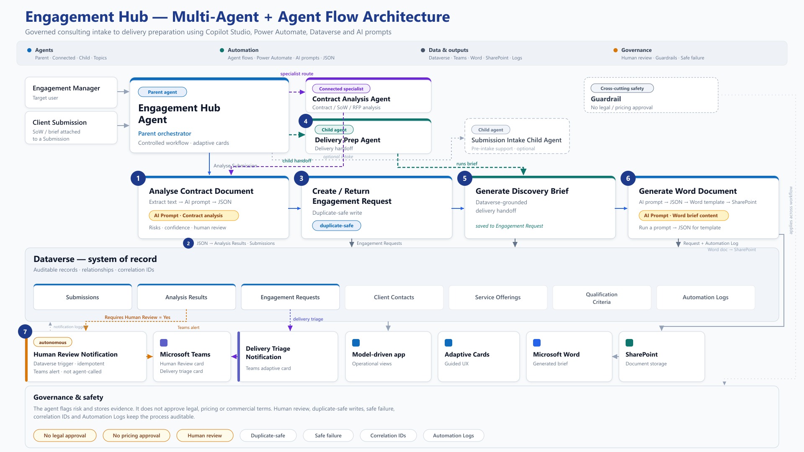
 
<details>
<summary>Text version of the architecture</summary>

```text
┌──────────────────────────────────────────────────────────────────────────────┐
│                         Engagement Hub Agent                                 │
│                         Parent orchestration agent                           │
│              Topics · Global variables · Controlled user journeys            │
└───────────────┬────────────────────────┬────────────────────────┬───────────┘
                │                        │                        │
                ▼                        ▼                        ▼
┌──────────────────────────┐  ┌──────────────────────────┐  ┌──────────────────────────┐
│  Contract Analysis Agent  │  │ Submission Intake Child   │  │   Delivery Prep Child     │
│  Connected specialist     │  │ Child agent               │  │   Child agent             │
│  Document analysis        │  │ Intake preparation        │  │   Discovery brief         │
│  Risks · obligations      │  │ Missing information       │  │   Word handoff document   │
│  Human review flags       │  │ Submission summary        │  │   Delivery preparation    │
└──────────────┬───────────┘  └──────────────┬───────────┘  └──────────────┬───────────┘
               │                             │                             │
               ▼                             ▼                             ▼
┌──────────────────────────────────────────────────────────────────────────────┐
│                           Power Automate Flows                               │
│                                                                              │
│  Resolve Submission · Analyse Contract Document · Resolve Service Offering   │
│  Create / Return Engagement Request · Generate Discovery Brief               │
│  Generate Word Handoff Document · Notify Human Review · Write Logs           │
│                                                                              │
│  Agent-triggered flows + standalone backend notification flow                 │
└──────────────────────────────────────┬───────────────────────────────────────┘
                                       │
                                       ▼
┌──────────────────────────────────────────────────────────────────────────────┐
│                                Dataverse                                     │
│                                                                              │
│  Submissions · Analysis Results · Engagement Requests · Service Offerings     │
│  Client Contacts · Qualification Criteria · Automation Logs                   │
└──────────────────────────────────────┬───────────────────────────────────────┘
                                       │
                                       ▼
┌──────────────────────────────────────────────────────────────────────────────┐
│                         Microsoft 365 Outputs                                │
│                                                                              │
│  Model-driven app · Teams adaptive cards · SharePoint · Word template output  │
└──────────────────────────────────────────────────────────────────────────────┘
```
 
</details>

**Scale:** 1 parent orchestration agent · 1 connected specialist agent · 2 child agents · 7 core Dataverse tables · 8+ Power Automate flows in the wider solution, with selected core flows documented in this repo.

The demo video focuses on the analysis-to-delivery path: document analysis, Engagement Request creation, delivery handoff, Word document generation, Teams notification and audit logging. It does not show every wider architecture capability or every agent path.
 
---
 
## Key patterns and design decisions
 
### Pattern selection
 
The build uses a deliberate mix of patterns rather than agents everywhere:
 
| Pattern | Used when | In this build |
|---|---|---|
| Connected agent | Strong, self-contained domain boundary | Contract Analysis Agent |
| Child agent | Focused sub-task within the same business process | Submission Intake Child Agent; Delivery Prep Child Agent |
| Controlled topic | Behaviour must be deterministic — no generative improvisation | Engagement Request Confirmation, which is a controlled topic rather than a child agent |
| Agent flow | Records must be created, retrieved or updated reliably | Create / Resolve / Analyse flows |
| Backend cloud flow | Automation should be event-driven, no user present | Teams notification flows |
 
### Governance built in — not bolted on
 
- **Duplicate-safe records** — the create flow checks for an existing active Engagement Request before writing; duplicates are returned as successful governed outcomes, not errors
- **No GUIDs in the UX** — users work with friendly references (`SUB-0002`, `CA-0014`, `ENG-0020`); flows resolve to row IDs behind the scenes
- **Human confirmation gate** — no Engagement Request is created until a person explicitly confirms; generative orchestration never makes that call
- **Idempotent notifications** — Automation Logs are checked for a prior successful event before a Teams card is posted
- **Controlled failure paths** — expected business validation failures return controlled responses rather than being treated as technical exceptions; the delivery-prep flow uses a `varCanContinue`gate and a final response action on every path
- **Automation Log event taxonomy** — structured event names (`contract_analysis_started`, `engagement_request_duplicate_detected`, `human_review_notification_sent`) make every run queryable and auditable

### Human-in-the-loop by design
 
Delivery preparation uses a deliberate conversational handoff rather than an autonomous trigger — the consultant chooses when downstream work begins. AI surfaces risks and recommendations; people remain accountable for routing, review and delivery decisions.
 
---
 
## Screenshots
 
### The multi-agent journey
 
| Engagement Hub command centre | Copilot Studio agent overview |
|---|---|
| 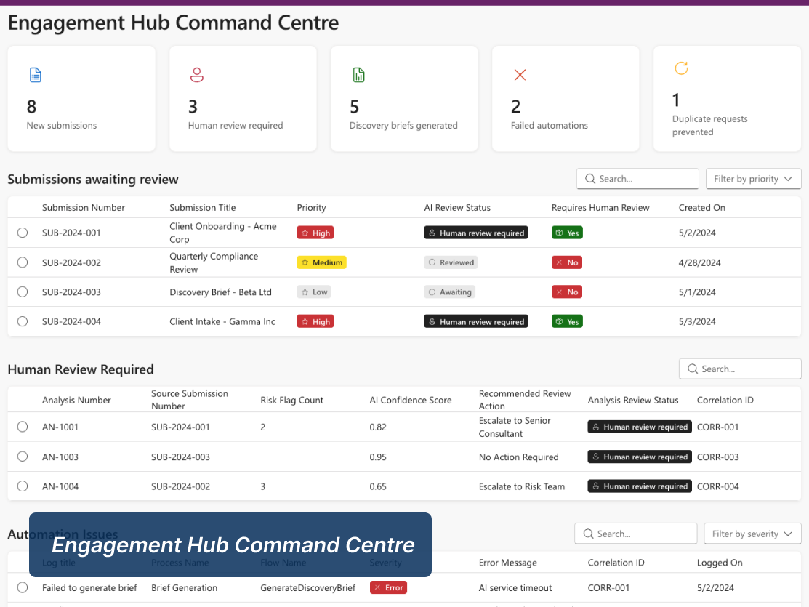 | 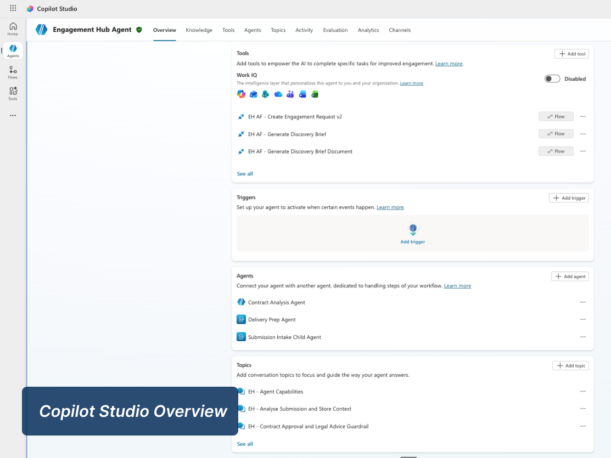 |
| Parent agent tools | Agent in Microsoft Teams |
| 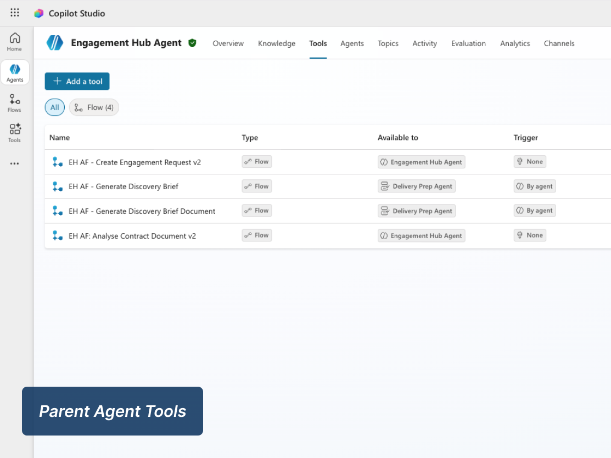 | 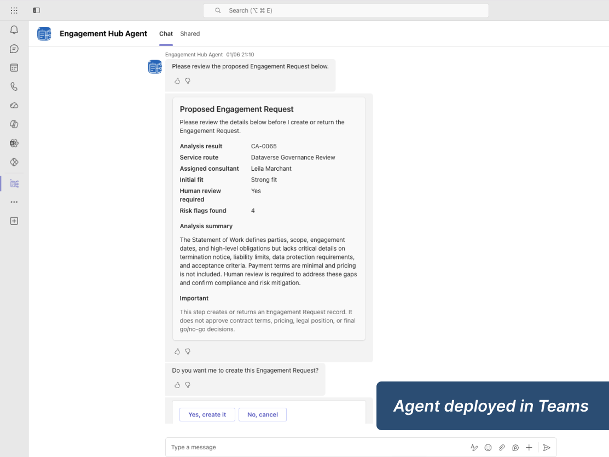 |
 
### The Engagement Request record
 
| Engagement overview | AI review & analysis |
|---|---|
| 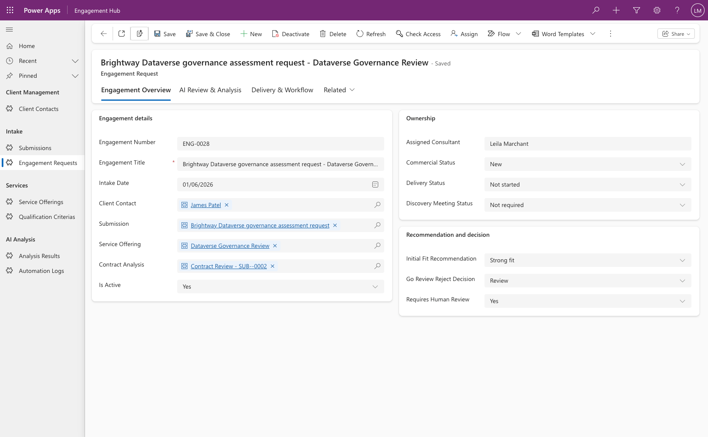 | 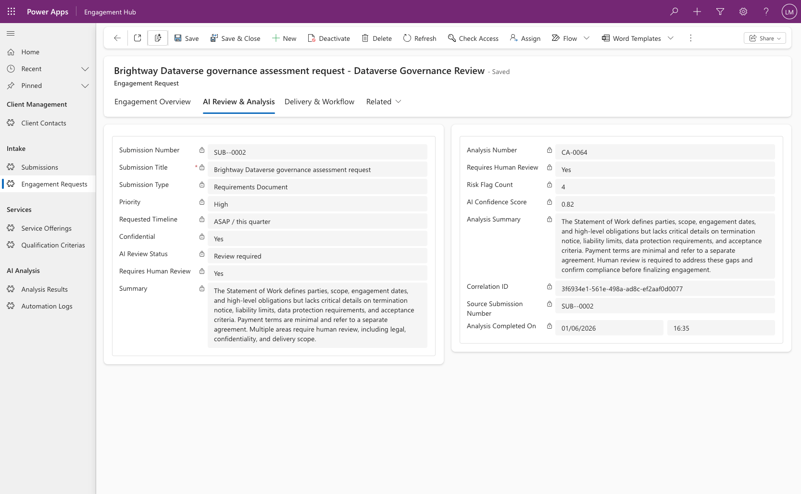 |
| Delivery operations | Delivery readiness |
| 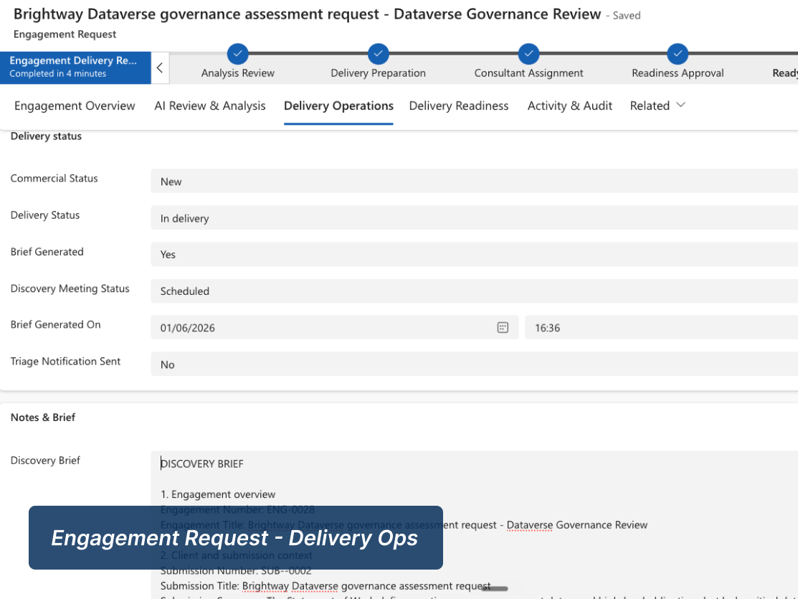 | 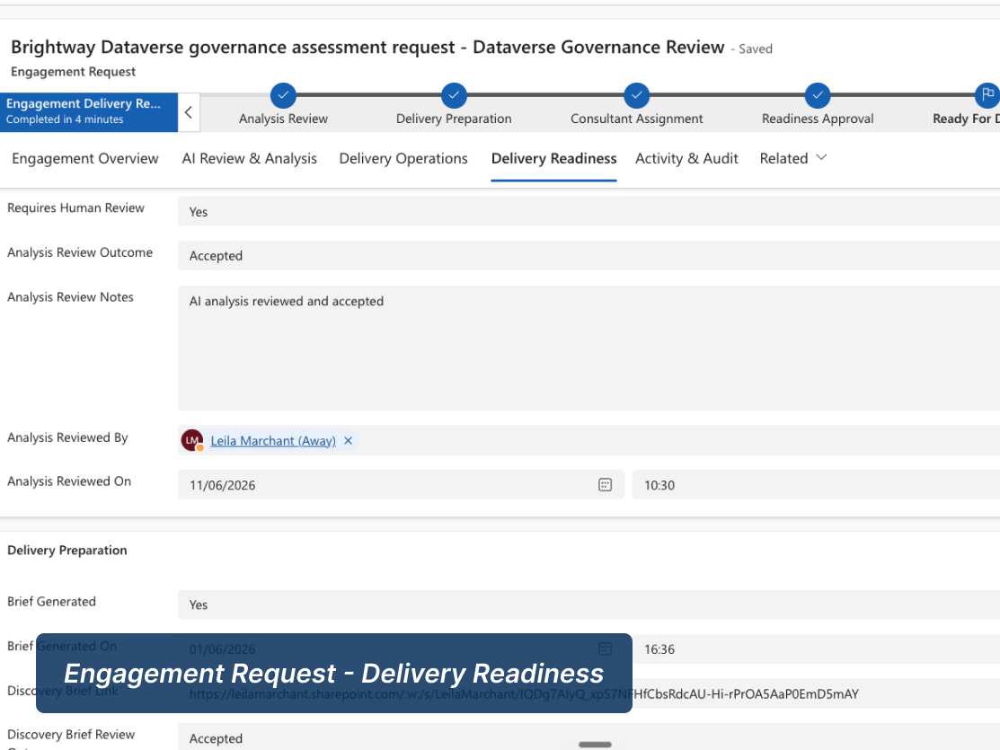 |
 
### Governance & evidence
 
| Duplicate-prevention automation log | Generated discovery brief (Word) |
|---|---|
| 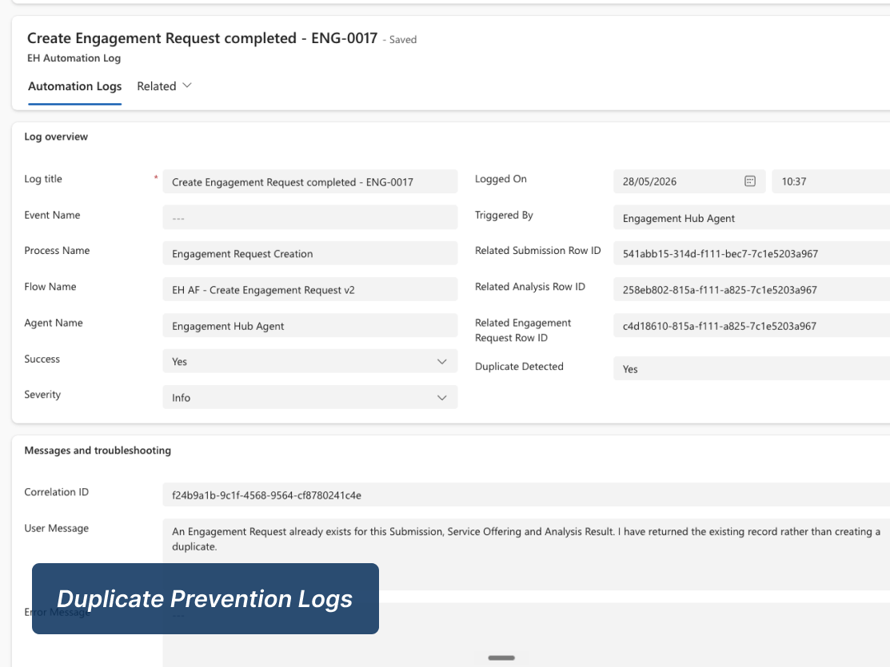 | 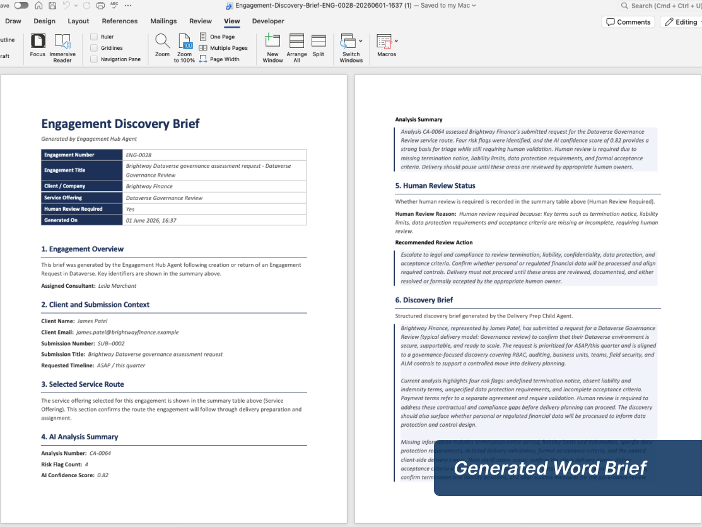 |
 
> Full evidence set — Copilot Studio agents and topics, AI prompts, safe-failure handling and SharePoint storage — in [`/screenshots`](screenshots/).
 
---
 
## Technology stack
 
`Copilot Studio` `Power Automate` `Dataverse` `Model-Driven Apps` `Microsoft Teams` `Adaptive Cards` `SharePoint` `Word Templates` `AI Prompts` `Structured JSON` `Power Fx` `Environment Variables` `Connection References`
 
---
 
## Repository structure
 
```
engagement-hub-agent/
├── architecture/       # Architecture notes, component descriptions and diagram
├── demo/               # Demo walkthrough and scenario guide
├── docs/               # Case study and ALM release checklist (PDF)
├── flows/              # Power Automate flow summaries and design notes
├── prompts/            # Sanitised AI prompt examples
├── screenshots/        # Evidence screenshots and workflow captures
└── README.md
```
 
> This is a **documentation and evidence repository** for a Microsoft Power Platform / Copilot Studio solution. It contains architecture notes, flow descriptions, sanitised prompts and demo materials rather than deployable application code, as Copilot Studio and Power Automate solutions are platform-managed artefacts.
 
### Recreating a similar solution
 
<details>
<summary>High-level setup steps</summary>
1. Create a Power Platform environment with Dataverse enabled.
2. Create the 7 Dataverse tables (Client Contacts, Submissions, Service Offerings, Qualification Criteria, Analysis Results, Engagement Requests, Automation Logs).
3. Build the model-driven app for operational review.
4. Create the Copilot Studio parent agent, connected specialist agent and child agents.
5. Add controlled topics for submission analysis, engagement confirmation, delivery handoff and legal/commercial guardrails.
6. Create the Power Automate flows and connect them to the agents as tools.
7. Configure SharePoint storage and a Word template with content controls.
8. Configure Teams channel notification for human review.
9. Add sample data and test the happy path, duplicate detection and safe failure paths.
</details>
---
 
## Lessons learned
 
Five things that changed how I think about building governed business agents:
 
1. **Pattern selection matters more than agent count.** The question is never "how many agents?" — it's "where does generative reasoning add value, and where does it add risk?"
2. **A failed lookup is a business outcome, not a technical exception.** Agent flows should never use `Terminate`; every path needs a controlled, logged response.
3. **Idempotency only works if the check is exact.** An event-name duplicate check works only when the event name, success flag and related row ID are all matched together — not any single field.
4. **Copilot Studio tool references need careful lifecycle management.** Avoid exposing the same tool in both a parent and child agent unless that is intentional. If stale references occur, first remove duplicate exposure and dependent mappings; then remove and re-add the affected tool or agent node cleanly, testing each layer before reconnecting the full workflow.
5. **The final step of a demo should not be its weakest.** The Discovery Brief result card was rebuilt specifically because the proof point of the whole multi-agent story should look like a business-system result, not a chatbot confirmation.
---
 
## Governance and safety boundaries
 
The agent **does not**: provide legal advice · approve contract terms · approve pricing or commercial decisions · make final go/no-go decisions · replace human review where risk is flagged.
 
The agent **does**: surface risks and missing information · store structured analysis evidence · flag when human review is required · provide confidence scores · maintain correlation IDs and Automation Logs · help delivery teams prepare consistent handoff material.
 
### Security
 
This repository does not include API keys, secrets, connection credentials, tenant-specific configuration, real client data or confidential information. All screenshots, prompts and documentation are sanitised demo material.
 
---
 
## Documentation
 
Architecture detail, demo screenshots, workflow evidence, governance analysis and downloadable PDFs:
 
**[📖 Full case study → leilamarchant.co.uk/case-study-engagement-hub](https://leilamarchant.co.uk/case-study-engagement-hub/)**
 
- [Engagement Hub case study (PDF)](docs/Engagement_Hub_Case_Study.pdf)
- [ALM release checklist (PDF)](docs/Engagement_Hub_ALM_Release_Checklist.pdf)
---
 
## Author
 
**Leila Marchant** — Power Platform & Copilot Studio Developer  
Winchester, UK · Remote / Hybrid
 
[🌐 Portfolio](https://leilamarchant.co.uk/) · [💼 LinkedIn](https://www.linkedin.com/in/leilamarchant) · [🎬 Demo video](https://youtu.be/Tzn6pMMoEAw)
 
<sub>Built for the Microsoft Agent Academy Live Hackathon — Operative Track · 2nd Place</sub>
